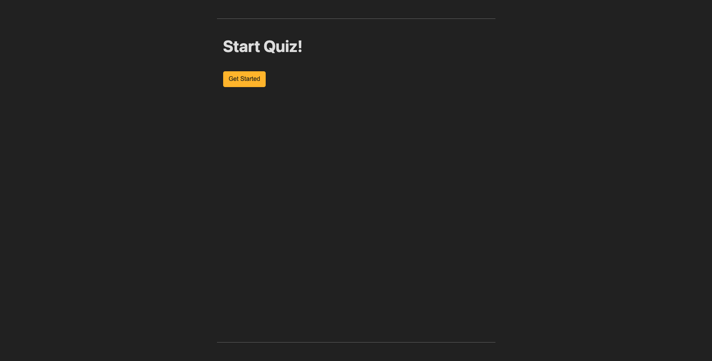

# My Portfolio

## Table of Contents

1. [Description](#description)
2. [Resources](#resources)
3. [Visuals](#visuals)
4. [Author and Aknowledgement](#author-and-aknowledgements)

## Decription

This Challenge requires students to build a timed coding quiz with multiple-choice questions. This application will run in the browser and will feature dynamically updated HTML and CSS powered by JavaScript code that we write. Our code must be clean, polished, and have a responsive user interface.

## Resources

-[LIVE SITE](https://github.com/raydover/code-quiz)

-[Repository](https://git@github.com:raydover/code-quiz.git)

## Visuals

## Authors and Acknowledgements

created by UNCC Coding Bootcamp Student, Raymond Dover
